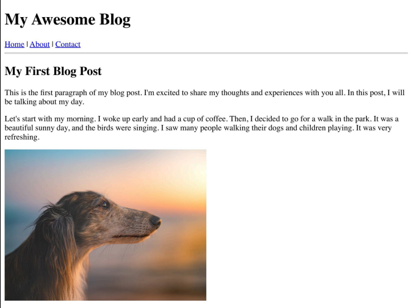
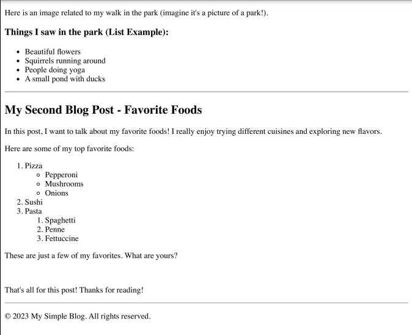
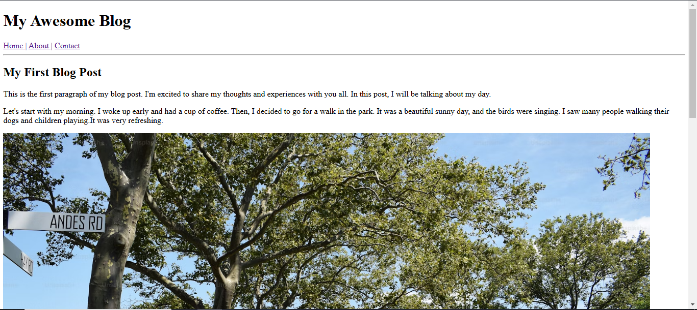
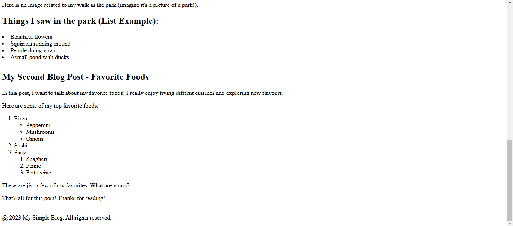

# Sheryians Coding School - Day 3 Notes

## HTML Learning Roadmap

### 📌 Starting with HTML
#### Understanding HTML and Its Use Cases
- **What is HTML?**
  - HTML (HyperText Markup Language) is the foundation of web development.
  - It defines the structure of web pages using tags.
  - Used in websites, web apps, emails, and documents.

- **Where is HTML used?**
  - Creating static web pages.
  - Structuring content in web applications.
  - Designing email templates.
  - Embedding media like images, audio, and video.

---
### 🔹 Creating Your First HTML Page in VS Code
**Steps:**
1. Open VS Code.
2. Create a new file and name it `index.html`.
3. Write a basic HTML template.
4. Install Live Server Extension in VS Code.
5. Run the file by right-clicking → Open with Live Server.

---
### 📂 Understanding HTML Structure
**Basic Components of an HTML Document:**
```html
<!DOCTYPE html>
<html>
<head>
    <title>My First Page</title>
</head>
<body>
    <h1>Welcome to HTML!</h1>
</body>
</html>
```

---
### 🔹 Understanding HTML Tags
**Basic HTML Tags:**
- `<h1> - <h6>` → Headings
- `<p>` → Paragraph
- `<a>` → Hyperlinks
- `` → Images
- `<div>` → Containers
- `<span>` → Inline elements

---
### 📜 Working with HTML Lists
**Types of Lists:**
- 🔹 Ordered List (`<ol>`) → Numbered list.
- 🔹 Unordered List (`<ul>`) → Bulleted list.
- 🔹 Nested Lists → Lists inside lists.

**Example:**
```html
<ul>
    <li>Item 1</li>
    <li>Item 2</li>
    <li>Item 3</li>
</ul>
```

---
### 🎨 HTML Attributes
**Common Attributes:**
- `id` → Unique identifier
- `class` → Grouping elements
- `src` → Image source
- `href` → Link reference

**Example:**
```html

```

---
### 🔗 Navigating Between Pages & Sections
**Linking another page:**
```html
<a href="about.html">Go to About Page</a>
```
**Jumping to a section:**
```html
<a href="#section1">Jump to Section 1</a>
```

---
### 🏗️ Understanding & Using `<div>` Tag
- `<div>` is a container for grouping elements.
- Used for styling, layout, and organization.

**Example:**
```html
<div class="container">
    <p>This is inside a div.</p>
</div>
```

---
### 🎭 Understanding Semantic Tags
**What are Semantic Elements?**
- `<header>` → Defines a page header.
- `<footer>` → Defines a page footer.
- `<section>` → Groups content in sections.
- `<article>` → Represents independent content.
- `<nav>` → Navigation links.

---
### 📩 HTML Forms & Inputs
**Creating a Simple Form:**
```html
<form>
    <label for="name">Name:</label>
    <input type="text" id="name" name="name">
    <input type="submit" value="Submit">
</form>
```

**Types of Input Fields:**
- Text, Email, Password, Radio, Checkbox, Submit, etc.

**Form Attributes:**
- `action`, `method`, `placeholder`, `value`.

---
### 📌 Final Summary
✅ Learned HTML structure, tags, attributes, lists, and tables.  
✅ Explored forms, media elements, semantic tags, and navigation.  
✅ Covered practical examples & common use cases.  
🎉 Now you're ready to build web pages!

---
### Project Exercise 1: Blog Website

#### Topic Covered: HTML

### Description:

Build a simple blog webpage that includes essential HTML elements like:
- Headings (`<h1>` to `<h6>`)
- Paragraphs (`<p>`)
- Unordered & Ordered Lists (`<ul>`, `<ol>`)
- Links (`<a>`)
- Images (``)

### The page should start with a DOCTYPE declaration and include the essential HTML tags:
- `<html>`
- `<head>`
- `<body>`

---

## Inspiration




---

## My Output Screenshots





