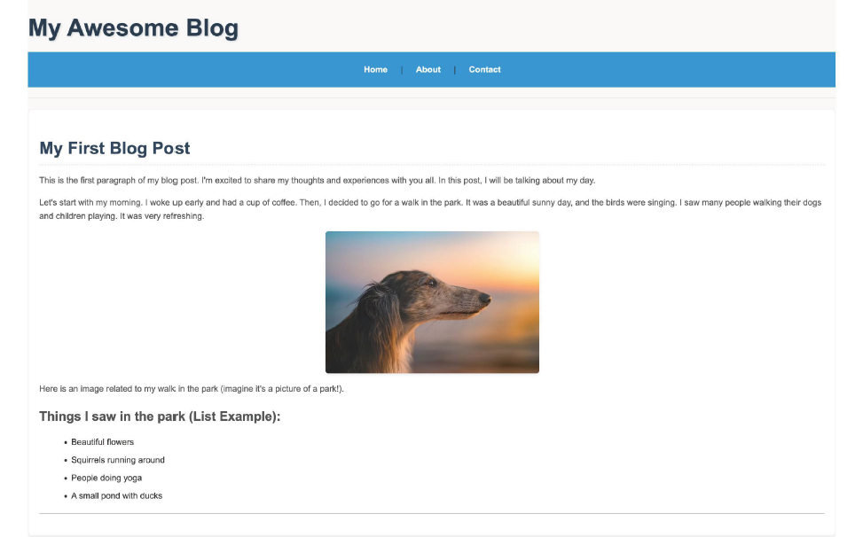
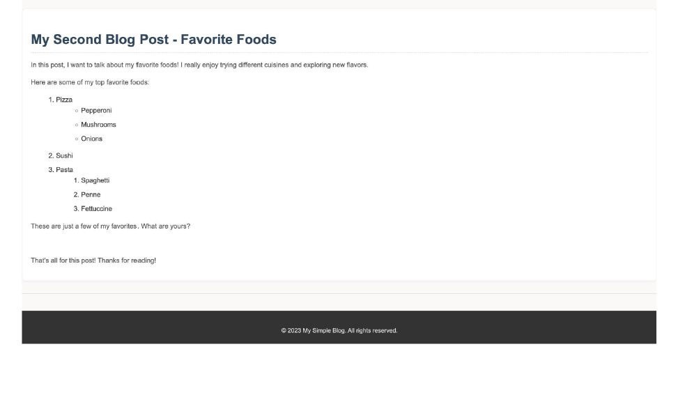

# Day 4 - Complete CSS Notes

## What is CSS & Why It’s Important?
CSS (Cascading Style Sheets) is a stylesheet language used to control the presentation of HTML documents. It allows developers to style web pages by defining colors, layouts, fonts, and spacing, ensuring better design and user experience.

## CSS Syntax & Structure
A CSS rule consists of a selector and a declaration block:

```css
selector {
  property: value;
}
```

## CSS Selectors
Selectors are used to target HTML elements:
- **Element Selector:** `p { color: blue; }`
- **Class Selector:** `.class { font-size: 16px; }`
- **ID Selector:** `#id { margin: 10px; }`

## Adding CSS to HTML
There are three ways to apply CSS:
1. **Inline CSS** - Inside the `style` attribute of an HTML element.
2. **Internal CSS** - Inside the `<style>` tag in the HTML `<head>`.
3. **External CSS** - Linked via a separate `.css` file.

## Selector Precedence (Specificity)
- Inline styles have the highest specificity.
- ID selectors (`#id`) have higher priority than class selectors (`.class`).
- Class selectors have higher priority than element selectors (`div`, `p`).
- The `!important` rule overrides all other styles.

## Text Styling Properties
### Font Properties
- `font-size`
- `font-family`
- `font-weight`

### Text Properties
- `color`
- `line-height`
- `text-align`

## Colors & Units in CSS
### Color Representation
- Named colors: `red`, `blue`, `green`
- RGB format: `rgb(255, 0, 0)`
- Hex format: `#ff0000`
- HSL format: `hsl(0, 100%, 50%)`
- RGBA format: `rgba(255, 0, 0, 0.5)` (adds transparency)

### CSS Units
- **Absolute Units:** `px`, `cm`, `mm`
- **Relative Units:** `%`, `rem`, `em`
- **Viewport Units:** `vw`, `vh`

## Box Model & Layout
### Box Properties
The CSS box model consists of:
- `width`
- `height`
- `padding`
- `margin`
- `border`

### Border Properties
```css
border-width: 2px;
border-style: solid;
border-color: black;
border-radius: 5px;
```

## Background & Shadows
### Background Properties
```css
background-color: #f0f0f0;
background-image: url('image.jpg');
background-size: cover;
background-position: center;
background-repeat: no-repeat;
```

### Shadow Effects
```css
box-shadow: 4px 4px 10px rgba(0, 0, 0, 0.5);
text-shadow: 2px 2px 5px rgba(0, 0, 0, 0.3);
```

## Project Exercise 3: Styling The Page
### Task:
Style the blog page created in Project Exercise 1 using CSS.

### Goals:
- Apply background colors to sections.
- Set text colors and choose appropriate fonts.
- Adjust text sizes, line heights, and font styles for readability.
- Apply padding and margins for proper spacing between elements.
- Utilize CSS selectors and the box model to structure and design the layout effectively.

### Skills Covered:
- CSS styling and applying selectors.
- Text formatting (fonts, sizes, colors).
- Understanding and using padding/margins.
- Mastering the box model for layout control.

---
## Project Exercise 3: Styling The Page
## 🌟 Inspiration




---

This concludes **Day 4** of the CSS journey! 🚀
